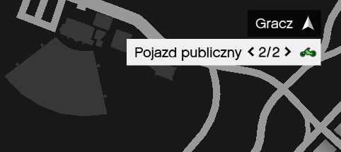
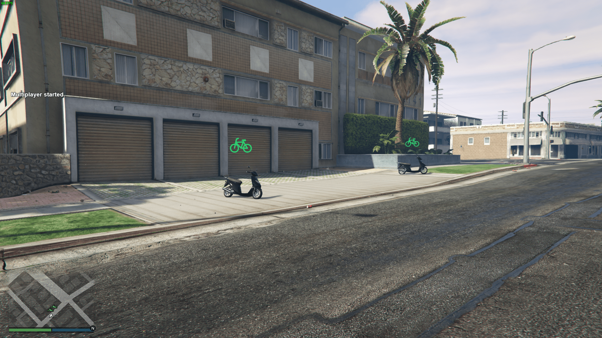

## Spis Treści

- [Działanie](#działanie)
- [Instalacja](#instalacja)
- [Ustawienia](#ustawienia)
- [Użyte technologie](#użyte-technologie)

System pojazdów publicznych do wykorzystania na serwerze GTA V RAGE MP.

## Działanie

Aby skorzystać z systemu pojazdów publicznych należy udać się w miejsce oznaczone na radarze zielonym motocyklem.

Po udaniu się na miejsce prezentuje się to następująco.

## Instalacja

- Plik index.js oraz settings.js należy umieścić w server-files w katalogu packages.

## ustawienia

- Wszelkie ustawienia znajdują się w pliku settings.js

## Użyte technologie

- Nodejs
